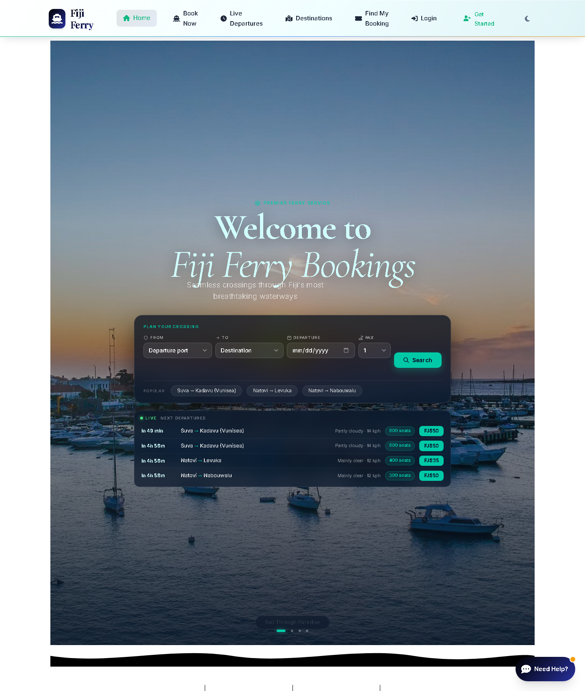
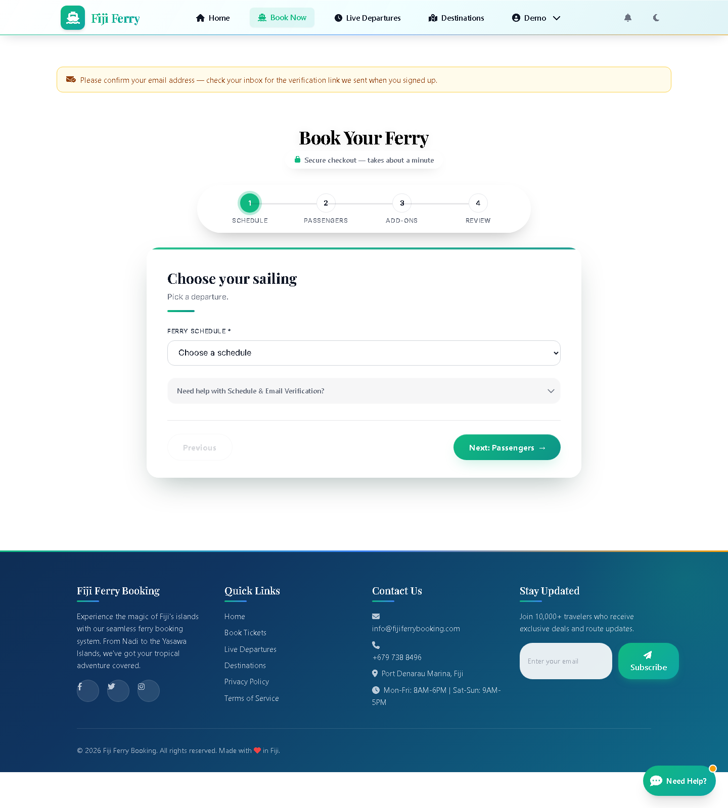
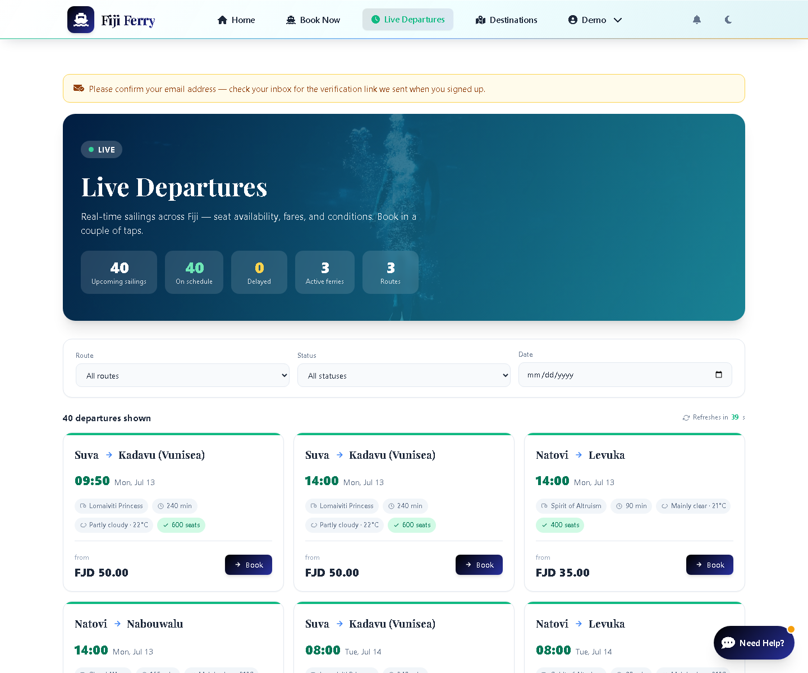
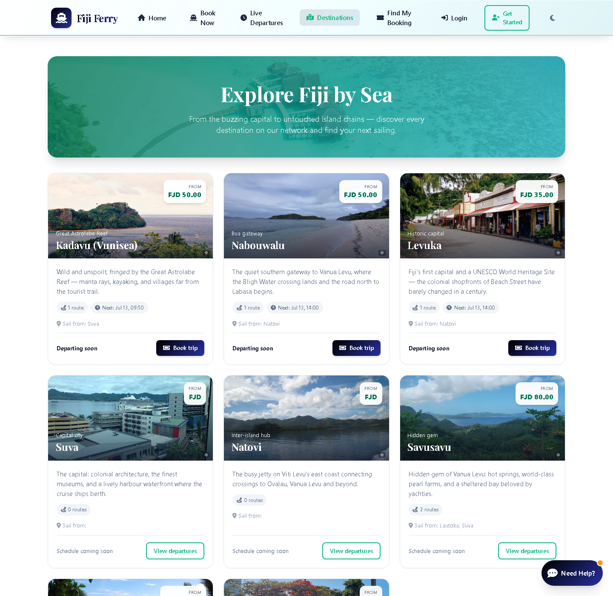
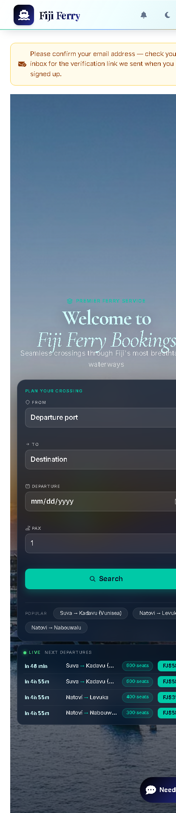
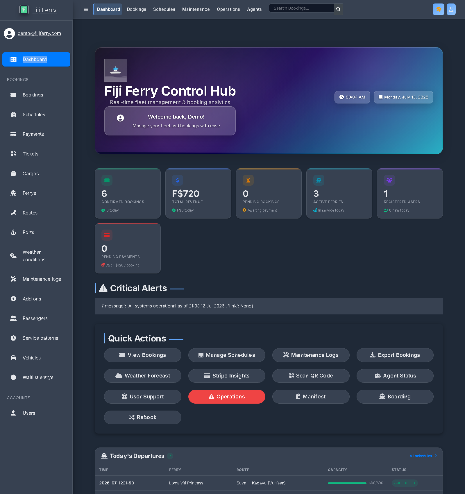
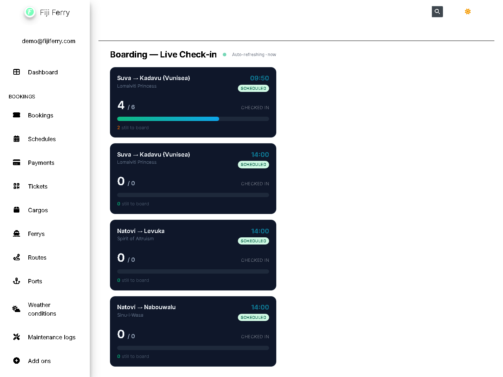
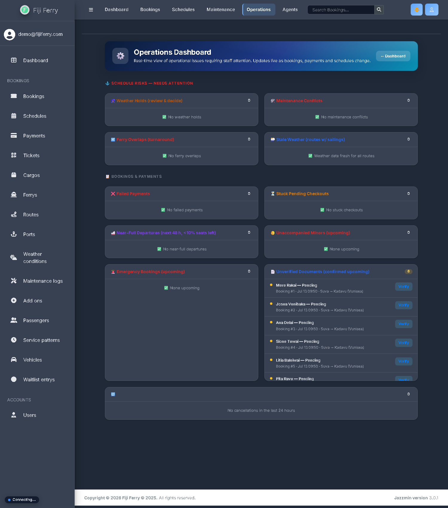
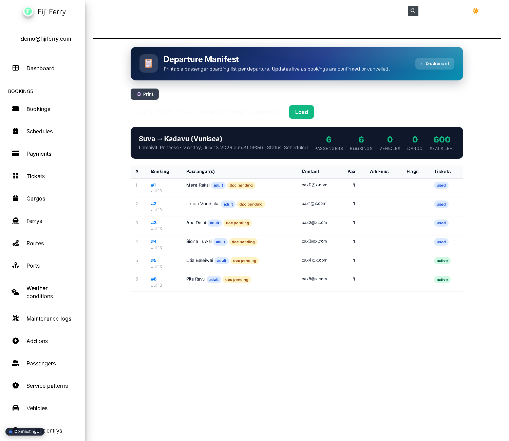
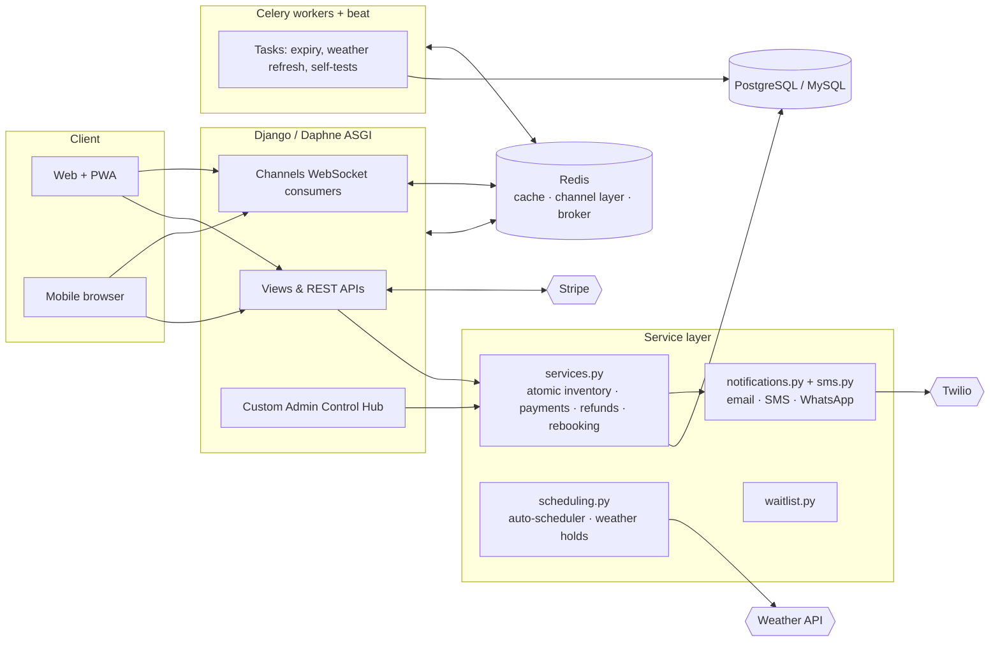

# 🛥️ Fiji Ferry Booking System

> A production-grade, real-time ferry reservation and fleet-operations platform for inter-island travel in Fiji — online booking, Stripe payments, QR boarding passes, live schedules, automated refunds, weather-aware operations, and a full operations control centre for staff.

Built with **Django 5**, **Django Channels (WebSockets)**, **Celery**, **PostgreSQL/MySQL**, **Redis**, and **Stripe**. Designed for the realities of the Fiji market: intermittent connectivity, mobile-first travellers, and safety-critical maritime operations.

<p align="center">
  
</p>

---

## ✨ Highlights

| | |
|---|---|
| 🎫 **End-to-end booking** | Multi-step wizard (schedule → passengers → add-ons → review), guest & account checkout, vehicles + cargo, group bookings, unaccompanied minors |
| 💳 **Real payments** | Stripe Checkout + webhooks, plus mock Fiji-local rails (ANZ, BSP, M-PAiSA, MyCash). **Idempotent** confirmation safe against webhook re-delivery |
| 💸 **Automated refunds** | Tiered, time-based cancellation policy with **idempotent Stripe refunds** and a full payment audit trail |
| 📱 **SMS / WhatsApp alerts** | Disruption, cancellation and boarding notifications over Twilio — because in Fiji, SMS reaches travellers when email doesn't |
| 🚨 **One-button disruption broadcast** | Cancel a sailing → auto-cancel + refund every booking → notify all passengers (email + SMS) → offer free one-click rebooking |
| 🛳️ **Live boarding board** | Gate-side "X of Y checked in" per departure, auto-refreshing, driven by QR ticket scans |
| 📡 **Real-time everything** | WebSocket-pushed schedule/seat/booking updates to both the customer site and the admin control hub, with a polling fallback |
| ⛅ **Weather-aware ops** | Live route weather; sailings auto-flagged to *weather hold* when wind/precipitation breach safety thresholds |
| 🤖 **Ops automation** | Auto-scheduler (fleet turnaround, berth & maintenance constraints), waitlist engine, offline self-test agent, server monitor |
| 🧾 **QR boarding passes** | Per-passenger tickets with unique QR tokens, PDF generation, and admin-side scan validation |

---

## 📸 Screenshots

### Customer experience
| Homepage & live search | Booking wizard | Live departures |
|---|---|---|
|  |  |  |

| Destinations | Mobile (PWA-installable) |
|---|---|
|  |  |

### Operations control centre (staff)
| Control Hub dashboard | Live boarding board |
|---|---|
|  |  |

| Operations dashboard | Departure manifest |
|---|---|
|  |  |

---

## 🏗️ Architecture



The **service layer** (`bookings/services.py`) is the heart of the system: every money- or inventory-critical operation (seat reservation, payment confirmation, cancellation/refund, rebooking, disruption broadcast) runs there under row-level locks (`SELECT … FOR UPDATE`) with atomic `F()` inventory updates. Views handle HTTP only. This guarantees **no overbooking and no double-refunds under concurrency**, and idempotency against Stripe webhook re-delivery.

📖 **Deep dive:** see [`docs/ARCHITECTURE.md`](docs/ARCHITECTURE.md) for the concurrency model, state machines, and design guarantees.

---

## 🧰 Tech stack

| Layer | Technology |
|---|---|
| **Backend** | Python 3.11+, Django 5.2, Django REST-style JSON APIs |
| **Real-time** | Django Channels 4, Daphne (ASGI), WebSockets |
| **Async tasks** | Celery 5 + django-celery-beat |
| **Data** | PostgreSQL (prod) / MySQL / SQLite (dev), Redis (cache · channel layer · broker) |
| **Payments** | Stripe Checkout + webhooks; mock Fiji-local gateways |
| **Messaging** | Email (SMTP / Brevo HTTP API), SMS + WhatsApp (Twilio) |
| **Frontend** | Server-rendered templates, vanilla JS, PWA (installable, offline-aware), Jazzmin-based admin |
| **PDF / QR** | ReportLab, qrcode |
| **Testing** | Django test suite, pytest, coverage (~100 tests) |
| **Deploy** | Render (Docker-free), WhiteNoise, Gunicorn/Daphne |

---

## 🔬 Engineering highlights (the interesting bits)

- **Concurrency-safe inventory** — seats, vehicle slots and cargo weight are all reserved under a single locked `Schedule` row; DB `CheckConstraint`s act as a last-line backstop that makes overselling physically impossible even if application logic is bypassed.
- **Idempotent payments & refunds** — payment confirmation keys off a unique `(booking, session_id)` row; refunds carry a Stripe `idempotency_key`. Safe to call from both the webhook and the success redirect, repeatedly.
- **Explicit booking state machine** — `transition_booking()` rejects illegal transitions (e.g. `cancelled → confirmed`), so there is no bypass path to a paid/void state.
- **One-button disruption broadcast** — `services.disrupt_schedule()` cancels a sailing and every booking on it, refunds per policy, releases inventory, voids tickets, and fans out email + SMS with a free one-click rebooking link — all idempotent and safe to retry.
- **Graceful degradation** — SMS/WhatsApp, weather, and websockets all **no-op cleanly when unconfigured or unreachable**; a down SMTP server or Redis instance never breaks a booking.

---

## 🚀 Quick start (local, SQLite — zero external services)

```bash
git clone <repository-url> && cd fiji_ferry_booking
python -m venv venv && source venv/Scripts/activate    # Windows: venv\Scripts\activate
pip install -r requirements.txt
cp .env.example .env                                   # fill in as needed
python manage.py migrate
python manage.py ensure_demo_data                      # seed ports, routes, ferries, schedules
python manage.py createsuperuser
python manage.py runserver
```

Visit **http://127.0.0.1:8000/** for the traveller site and **/admin/** for the operations control hub.

> Full production setup (PostgreSQL/MySQL, Redis, Celery, Stripe & Twilio keys) is documented in [`DEPLOY.md`](DEPLOY.md) and [`OPERATIONS.md`](OPERATIONS.md).

### Configuration you may want

| Env var | Purpose |
|---|---|
| `STRIPE_SECRET_KEY` / `STRIPE_WEBHOOK_SECRET` | Real card payments & refunds |
| `TWILIO_ACCOUNT_SID` / `TWILIO_AUTH_TOKEN` / `TWILIO_SMS_FROM` | SMS/WhatsApp alerts (blank = email only) |
| `REFUND_FULL_HOURS` / `REFUND_PARTIAL_HOURS` / `REFUND_PARTIAL_PCT` | Tune the refund policy |
| `WEATHER_HOLD_WIND_KMH` / `WEATHER_HOLD_PRECIP_PCT` | Safety thresholds for auto weather-holds |

---

## ✅ Testing

```bash
python manage.py test bookings --settings=ferry_system.test_settings
```

The suite runs fully offline — Stripe and email are mocked, channels use an in-memory layer — and covers the state machine, seat-inventory concurrency, payment/refund flows, the disruption broadcast, SMS routing, weather holds, and API/authorization boundaries.

---

## 📁 Project structure

```
fiji_ferry_booking/
├── ferry_system/          # Project config, ASGI, Celery, settings
├── accounts/              # Custom user model, auth, profiles
├── bookings/
│   ├── models.py          # Ports, Ferries, Routes, Schedules, Bookings, Tickets, Waitlist…
│   ├── services.py        # ⭐ Authoritative money/inventory service layer
│   ├── notifications.py   # Email senders
│   ├── sms.py             # ⭐ SMS / WhatsApp channel (Twilio)
│   ├── scheduling.py      # Auto-scheduler + weather holds
│   ├── waitlist.py        # Waitlist + one-click rebooking
│   ├── admin.py           # Custom admin site: dashboards, boarding, ops, manifest
│   ├── consumers.py       # WebSocket consumers
│   ├── tasks.py           # Celery tasks
│   └── tests.py           # Test suite
├── templates/             # Customer site + admin control hub
├── docs/screenshots/      # README imagery
└── manage.py
```

---

## 👥 Team & origin

Originally built for **IS314** (University of the South Pacific, Semester 2 2025, supervised by Mr. Ravneil Nand) and since extended into a full operations platform.

| Student ID | Name |
|------------|------|
| S11210953  | Lagilava Paulo |
| S11221892  | Pene Konousi |
| S11223573  | Rigieta Nagera |
| S11221570  | Sekove Koroi |
| S11196578  | Kesaia Waqavakatoga |

## 📄 License

Educational project (IS314). Not affiliated with any real ferry operator.
